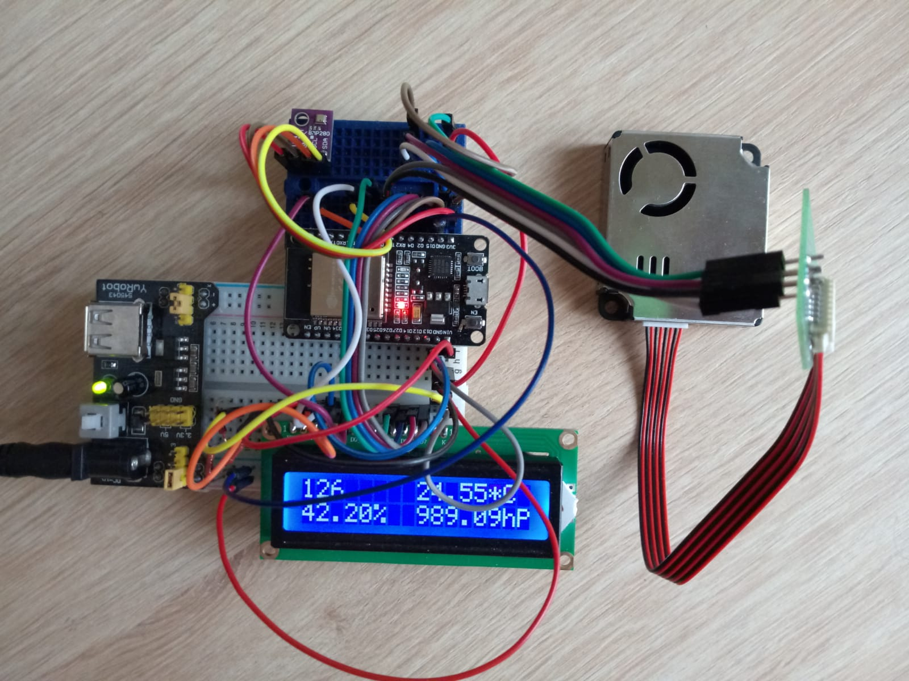

# peepWeather

## Overview

Wather station checking:
- humidity
- pessure
- temperature
- air quality (PM 1, 2.5, 10)

Sending data to Bluetooth client, AWS IoT client (MQTT) and showing current data on lyquid crystal (2x16) screen.

## Prerequisities

### Hardware

* ESP32 (DOIT ESP32 DEVKIT V1) - Microcontroler with WiFi and Bluetooth. Available to program using Arduino IDE - very popular - a lot of libraries are available

* BME280 (Bosh) - Temperature, humidity and pressure sensor

* PMS 9003 (Plantower) - Air quality sensor

* Liquid crystal 2x16 - Screen

### Software

* Arduino IDE with installed *DOIT ESP32 DEVKIT V1 board* 

* Arduino libraries: 
  * [PMS Library](https://github.com/fu-hsi/pms)
  * [Adafruit BME280 Library](https://github.com/adafruit/Adafruit_BME280_Library)
  * [ArduinoJson](https://arduinojson.org/?utm_source=meta&utm_medium=library.properties)
  * [LiquidCrystal](https://www.arduino.cc/en/Reference/LiquidCrystal)
  * [WiFi](https://www.arduino.cc/en/Reference/WiFi)
  * [MQTT](https://github.com/256dpi/arduino-mqtt)

## Installation

### Schema with sensors

### Image of working prototype with screen

